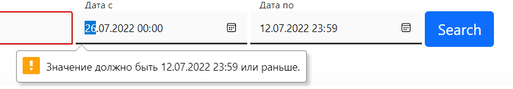

# MReport
## Описание проекта
Данное приложение предназначено для работников банка.

## Функционал
В проекте присутствует следующий функционал:
1. Просмотр отчета онлайн в виде таблицы.
2. Сохранение отчета в формате xlsx (Exel).

Так же в приложении осуществляется аутентификация с помощью ldap,
что значительно упрощает работу.


## Скрины приложения
1. Главная страница приложения

2. Страница с отчетами

3. Неверно введенные данные

4. Неверно введена дата

5. Результат запроса

6. Сохраненный Exel файл

7. Во время поиска бегает котик


### Инструкция по настройке проекта:
Самый удобный для запуска проекта - PyCharm. Можно запустить на ОС Windows или Linux.

1. Склонировать проект
2. Открыть проект в PyCharm с наcтройками по умолчанию
3. Создать виртуальное окружение (через settings -> project "BankProject" -> project interpreter)
4. Открыть терминал в PyCharm, проверить, что виртуальное окружение активировано.
5. Обновить pip:
   ```bash
   pip install --upgrade pip
   ```
6. Установить в виртуальное окружение необходимые пакеты: 
   ```bash
   pip install -r requirements.txt
   ```

7. Синхронизировать структуру базы данных с моделями: 
   ```bash
   python manage.py migrate
   ```

8. Создать суперпользователя
   ```bash
   python manage.py shell -c "from django.contrib.auth import get_user_model; get_user_model().objects.create_superuser('kolya', 'abc@123.net', '123')"
   ```

9. Создать конфигурацию запуска в PyCharm (файл `manage.py`, опция `runserver`)

